# SDN QoS Priority Controller (Mininet + OS-Ken/Ryu)

## 1. Overview

This project demonstrates Software Defined Networking (SDN)-based Quality of Service (QoS) using OpenFlow 1.3. A custom controller applies priority-based forwarding and access control policies on a Mininet topology.

The controller supports Ryu-compatible execution and is run with OS-Ken in this environment.

## 2. What This Project Proves

- The controller initializes correctly and handles OpenFlow events.
- The switch-controller handshake is successful.
- Allowed traffic is forwarded correctly.
- Blocked traffic is denied by explicit firewall rules.
- Queue-based QoS policies are enforced using OpenFlow actions.
- Under congestion, QoS significantly improves latency.
- Artifacts and outputs are validated with an automated script.

## 3. Project Structure

```text
.
├── controller/
│   └── qos_priority_controller.py
├── topology/
│   └── orange_qos_topology.py
├── scripts/
│   ├── compare_latency.py
│   ├── run_demo.sh
│   ├── sdn_qos_experiment.py
│   ├── setup_env.sh
│   └── validate_artifacts.py
├── artifacts/
│   ├── baseline/
│   ├── qos/
│   └── latency_comparison.txt
├── screenshots/
├── docs/
│   └── PROOF_OF_EXECUTION_TEMPLATE.md
├── Makefile
├── requirements.txt
└── README.md
```

## 4. Network and Policy Summary

### Network Topology

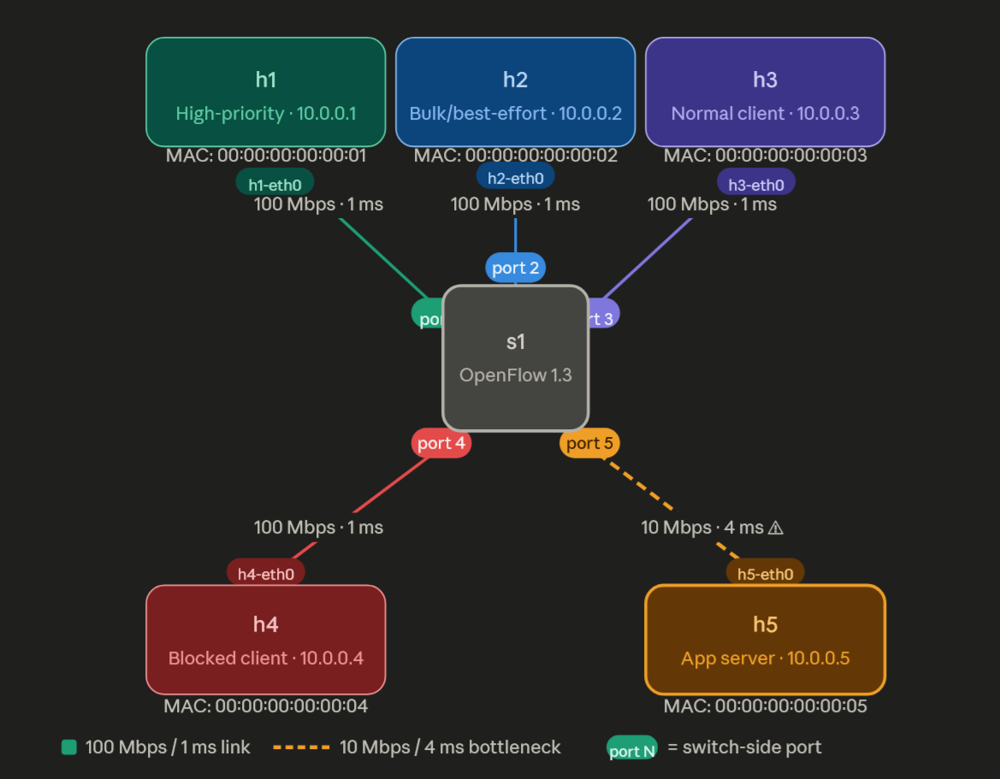

This topology consists of a single OpenFlow 1.3 switch (s1) connecting five hosts.
Traffic to the application server (h5) is constrained by a 10 Mbps bottleneck link,
allowing evaluation of QoS policies such as prioritization, best-effort handling,
and traffic blocking.

- Topology: single OpenFlow 1.3 switch (`s1`) with hosts `h1` to `h5`
- Server: `h5`
- Allowed priority source: `h1`
- Bulk traffic source: `h2`
- Blocked source: `h4`

Policy highlights:

- Firewall DROP rule for traffic from `10.0.0.4` to `10.0.0.5`
- High-priority traffic assigned to `queue 1`
- Best-effort traffic assigned to `queue 0`
- Dynamic flow handling via PacketIn + match-action rules

## 5. Execution Commands

Environment setup:

```bash
bash scripts/setup_env.sh
```

Run full experiment:

```bash
bash scripts/run_demo.sh all
```

Run individual modes:

```bash
bash scripts/run_demo.sh baseline
bash scripts/run_demo.sh qos
```

Validate outputs:

```bash
python3 scripts/validate_artifacts.py
```

## 6. Proof of Execution (Screenshots)

### Screenshot 1: Controller Initialization (OS-Ken Startup)

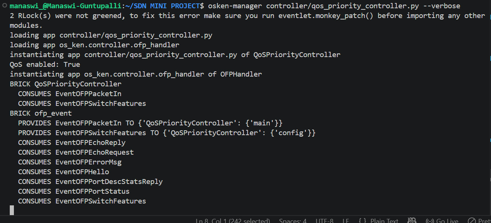

What is shown:

- Successful startup of the SDN controller using OS-Ken
- Controller loads `qos_priority_controller.py` and OpenFlow handler modules
- Log output indicates `QoS enabled: True`

What it proves:

- Controller is running correctly
- QoS logic is enabled
- OpenFlow 1.3 support is active

### Screenshot 2: Switch-Controller Handshake (OpenFlow Events)

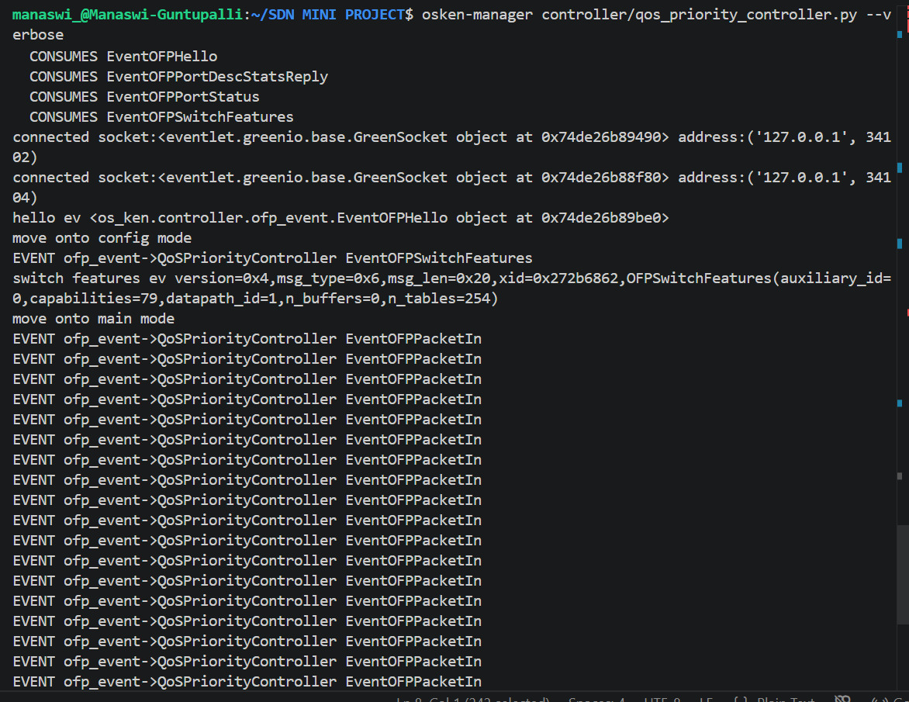

What is shown:

- `EventOFPSwitchFeatures` and `EventOFPPacketIn` events after Mininet startup
- Messages such as `move onto config mode` and `move onto main mode`

What it proves:

- Switch successfully connected to controller
- Flow table initialization happened
- Controller is actively processing packets

### Screenshot 3: Allowed Traffic (Ping Success)

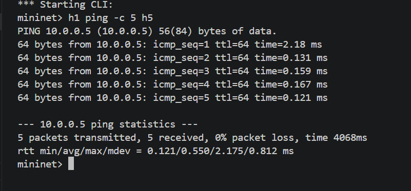

What is shown:

- Ping from `h1` (allowed host) to `h5` (server)
- `0%` packet loss with low average RTT

What it proves:

- Controller allows legitimate traffic
- Forwarding rules are working
- Low latency indicates efficient routing

### Screenshot 4: Blocked Traffic (Firewall Rule)

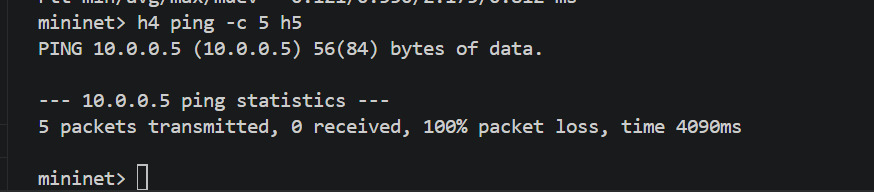

What is shown:

- Ping from `h4` (blocked host) to `h5`
- `100%` packet loss

What it proves:

- Firewall rule is working
- Controller installed DROP behavior for blocked flow
- Access control is implemented correctly

### Screenshot 5: Flow Table Entries (OpenFlow Rules)

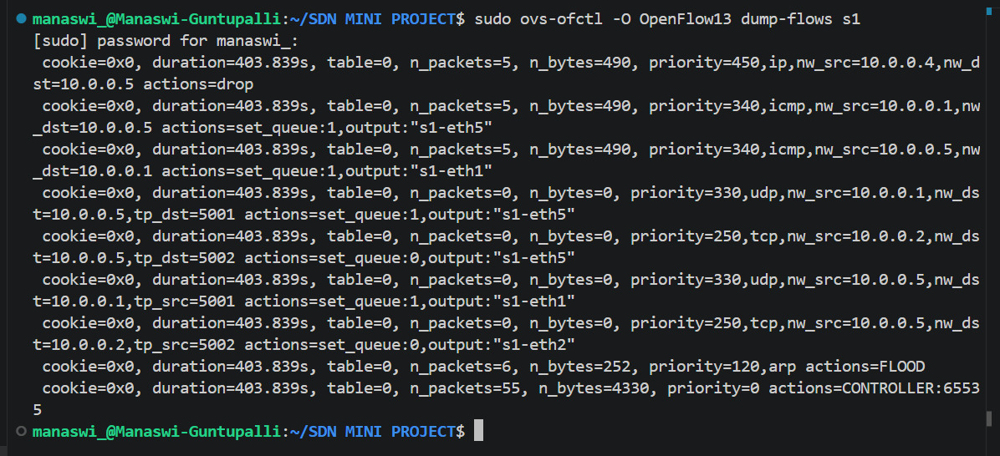

Command used:

```bash
sudo ovs-ofctl -O OpenFlow13 dump-flows s1
```

What is shown:

- DROP rule for `nw_src=10.0.0.4` with `actions=drop`
- QoS rule using `set_queue:1`
- Best-effort rule using `set_queue:0`
- Priority ordering (e.g., 450, 340, 250)

What it proves:

- Match-action OpenFlow rules are implemented
- QoS queues are assigned correctly
- Policy priorities are enforced in the switch

### Screenshot 6: TCP Bulk Traffic (Congestion Generation)

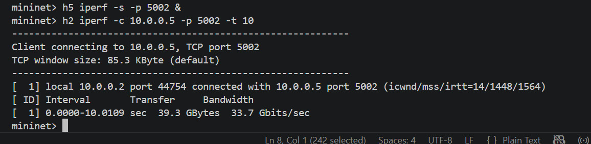

What is shown:

- TCP traffic from `h2` to `h5` using `iperf`
- High reported throughput in the capture (due to Mininet's virtualized environment; actual link capacity is 10 Mbps)

What it proves:

- Bulk TCP traffic is successfully generated
- This traffic creates congestion at the bottleneck link (10 Mbps)
- It serves as background load for evaluating QoS behavior under contention

### Screenshot 7: UDP High-Priority Traffic (QoS Flow)

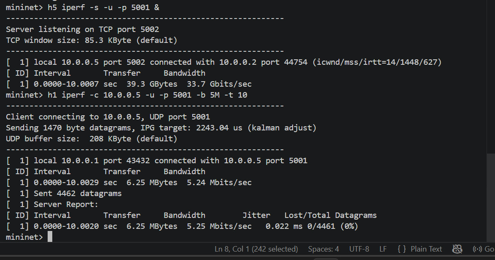

What is shown:

- UDP traffic from `h1` to `h5` on port `5001`
- Around `5.25 Mbits/sec`, very low jitter, and `0%` packet loss

What it proves:

- High-priority traffic remains stable
- QoS queue (`queue 1`) is effective
- Real-time traffic behavior is simulated successfully

### Screenshot 8: Network Shutdown (Clean Termination)

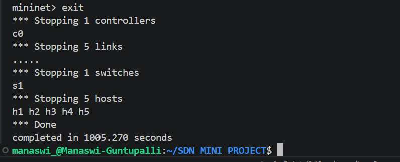

What is shown:

- Mininet shutdown logs: stopping controllers, switches, and hosts
- `Done` without crash output

What it proves:

- Experiment lifecycle completes cleanly
- No runtime crashes during teardown
- Resource cleanup is handled properly

### Screenshot 9: Latency Comparison (Performance Analysis)

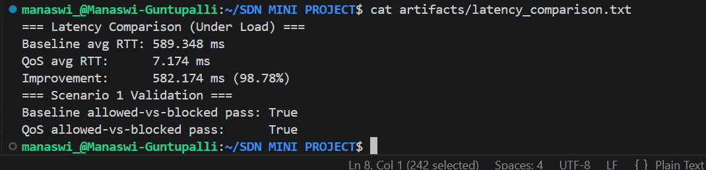

Command used:

```bash
cat artifacts/latency_comparison.txt
```

What is shown:

- Baseline RTT: `589 ms`
- QoS RTT: `7 ms`
- Improvement: `98.78%`

What it proves:

- QoS drastically reduces latency under congestion
- Congestion is handled effectively for priority traffic
- Strong quantitative performance evidence is provided

### Screenshot 10: Validation Script Output

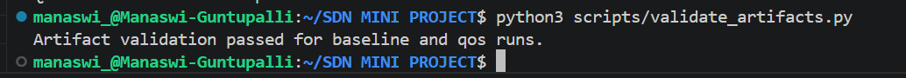

Command used:

```bash
python3 scripts/validate_artifacts.py
```

What is shown:

- Artifact validation passed

What it proves:

- Baseline and QoS outputs are consistent
- Generated evidence files are complete and valid
- Regression-style verification is included

### Screenshot 11: Packet Capture - UDP QoS Traffic (High Priority Flow)

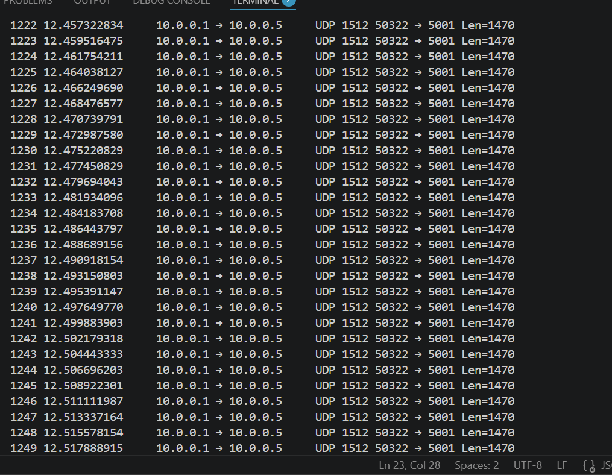

Command used:

```bash
sudo tshark -i s1-eth5 udp port 5001
```

What is shown:

- UDP packets from `10.0.0.1` to `10.0.0.5` on destination port `5001`
- Dense, continuous packet stream with packet length around `1470` bytes

What it proves:

- UDP traffic is generated correctly
- High-priority QoS flow is active
- Packets are forwarded through the switch as expected
- Classification by UDP port `5001` is working

### Screenshot 12: Packet Capture - ICMP (Ping Traffic Analysis)

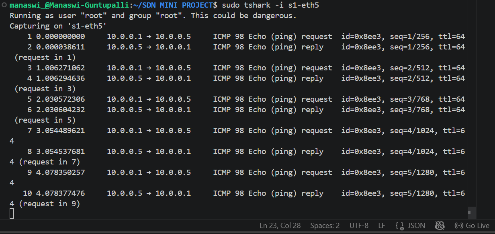

Command used:

```bash
sudo tshark -i s1-eth5 icmp
```

What is shown:

- ICMP Echo Requests from `10.0.0.1` to `10.0.0.5`
- ICMP Echo Replies from `10.0.0.5` to `10.0.0.1`
- Matching sequence progression (`seq=1`, `seq=2`, `seq=3`) and normal `TTL=64`

What it proves:

- Bidirectional communication is working
- Controller forwards ICMP packets correctly
- No packet drops for the allowed host
- Observed delay is minimal

### Packet-Level Validation

Packet capture using TShark confirms that:

- High-priority UDP traffic is consistently transmitted and classified correctly.
- ICMP packets experience minimal delay and zero loss.
- This validates the effectiveness of the SDN controller's QoS and forwarding logic at the packet level.

## 7. Key Artifacts

- `artifacts/baseline/summary.json`
- `artifacts/qos/summary.json`
- `artifacts/latency_comparison.txt`
- `artifacts/baseline/scenario1_allowed_ping.txt`
- `artifacts/baseline/scenario1_blocked_ping.txt`
- `artifacts/qos/scenario1_allowed_ping.txt`
- `artifacts/qos/scenario1_blocked_ping.txt`
- `artifacts/baseline/baseline_flow_table.txt`
- `artifacts/qos/qos_flow_table.txt`

## 8. Final Conclusion

The results demonstrate that SDN-based QoS significantly improves latency under congestion, while also enabling fine-grained traffic control through OpenFlow rules.

## 9. References

1. Mininet Documentation: http://mininet.org/walkthrough/
2. Ryu Documentation: https://ryu.readthedocs.io/en/latest/
3. OpenFlow Switch Specification 1.3: https://opennetworking.org/sdn-resources/openflow-switch-specification/
